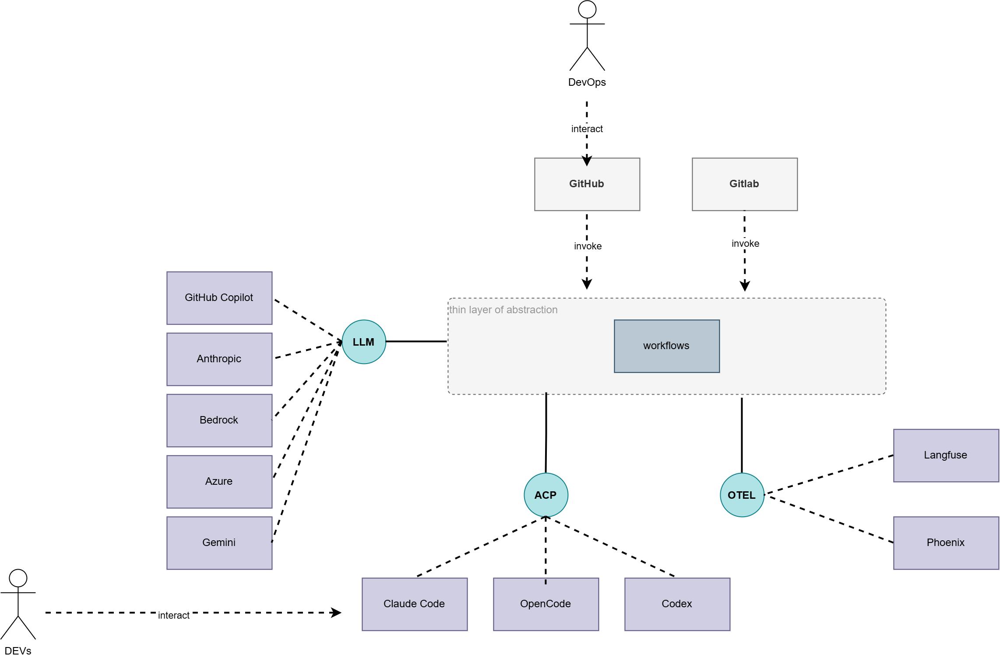
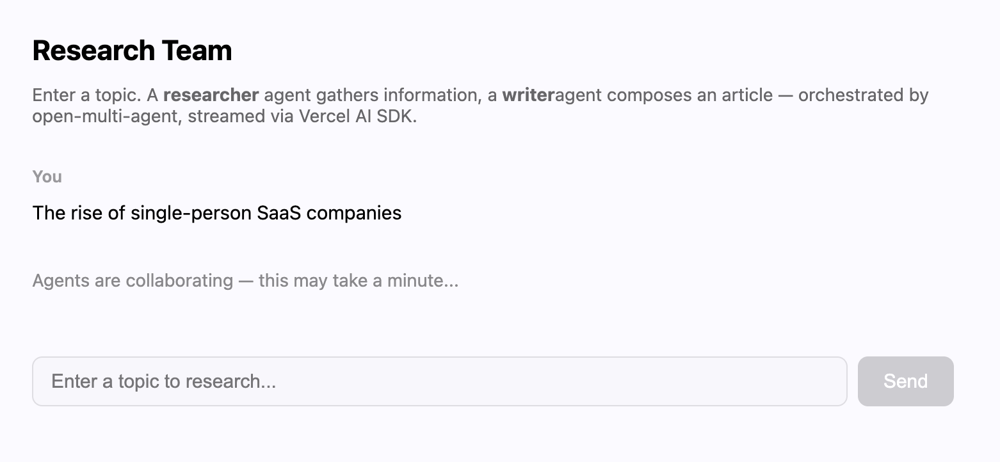

<!-- _class: lead -->

# Open Multi-Agent

Run modes · ACP · Budgets · Teams · Vercel AI SDK

`oma-metafactory` — September 2026

---

## Agenda

1. Run modes — compare the tradeoffs
2. ACP features
3. Budget control
4. Team collaboration
5. Task pipeline
6. Vercel AI SDK integration

---

<!-- fit -->

## Choose a Run Mode

| | `runAgent()` | `runTeam()` | `runTasks()` |
|---|---|---|---|
| **You provide** | one agent + prompt | team + goal | tasks, assignees, `dependsOn` |
| **OMA handles** | model loop, tools, streaming | decompose → DAG, parallel, synthesize | ordering, parallel, retries |
| **Tradeoff** | lowest overhead, no collaboration | plan adapts; adds a planning call | you own & maintain the graph |

### Compare the tradeoffs

- Lowest setup & runtime overhead → `runAgent()`
- Least graph maintenance → `runTeam()`
- Most predictable topology → `runTasks()`
- One synthesized team answer → `runTeam()`
- Raw per-task outputs → `runTasks()` / `runFromPlan()`

Ref: [three-ways-to-run](https://open-multi-agent.com/getting-started/three-ways-to-run/#compare-the-tradeoffs)

---

## ACP in the Architecture



---

## ACP Features

- **Agent Communication Protocol** — runs external coding agents (`Claude Code`, `OpenCode`, `Codex`) as managed subprocesses under OMA
- Lives in the **thin layer of abstraction** beside **OTEL**: the LLM drives **workflows**, which dispatch work over ACP and emit traces over OTEL
- Traces flow to observability backends — **Langfuse** and **Phoenix**
- Two entry points: **DevOps** via GitHub / GitLab (`invoke`), and **DEVs** interacting directly with the agents

Ref: [external-agents](https://open-multi-agent.com/reference/external-agents/)

---

<!-- fit -->

## Budget Control

Two run-level guardrails in `OrchestratorConfig`:

| Guardrail | Use when | Counts |
|---|---|---|
| `maxTokenBudget` | a token ceiling is enough, or pricing unavailable | cumulative input + output tokens |
| `maxCostBudget` + `estimateCost` | models / providers have different prices | caller-defined cost per LLM result |

- **Circuit breaker, not a billing meter** — checked at turn & task boundaries; a run can exceed the ceiling by up to one model turn
- OMA ships **no price table** — keep pricing in your own config and fail closed on unknown models
- On exhaustion (`status.code === 'budget_exhausted'`): persist partial output, seek approval, or route to a cheaper model — don't auto-retry larger

Ref: [cost-budget-control](https://open-multi-agent.com/guides/cost-budget-control/)

---

## Team Collaboration

Three specialised agents — **architect**, **developer**, **reviewer** — collaborate on a shared goal. The `OpenMultiAgent` orchestrator breaks the goal into tasks, assigns them to the right agents, and collects the results.

- Build the team with `createTeam()` + `sharedMemory: true`
- Run with `runTeam(team, goal)` — the coordinator decomposes, schedules, and synthesizes
- Per-agent results and token usage are reported in the run result

Ref: [team-collaboration](https://open-multi-agent.com/examples/team-collaboration/)

---

<!-- fit -->

## Task Pipeline — Workflow Syntax

Explicit dependency chain: `design → implement → test + review (parallel)`

```typescript
const tasks = [
  { title: 'Design',    assignee: 'designer' },
  { title: 'Implement', assignee: 'implementer', dependsOn: ['Design'] },
  { title: 'Test',      assignee: 'tester',      dependsOn: ['Implement'] },
  { title: 'Review',    assignee: 'reviewer',    dependsOn: ['Implement'] }, // parallel with Test
]

const result = await orchestrator.runTasks(team, tasks)
```

Ref: [task-pipeline](https://open-multi-agent.com/examples/task-pipeline/)

---

<!-- fit -->

## Vercel AI SDK Integration

OMA sits **above** the AI SDK — complementary layers:

| | Vercel AI SDK | open-multi-agent |
|---|---|---|
| Layer | LLM calls + streaming UI | multi-agent orchestration |
| Core strength | `useChat`, `streamText`, structured output | `runTeam()` decomposition, dependency scheduling, shared memory |

**Two-phase route:** (1) `runTeam()` runs a researcher + writer over shared memory → (2) the coordinator's output is piped into `streamText` and streamed to the browser via `useChat`.

Ref: [multi-agent-vercel-ai-sdk](https://open-multi-agent.com/blog/multi-agent-vercel-ai-sdk/)

---

## Vercel AI SDK — Web UI



Ref: [multi-agent-vercel-ai-sdk](https://open-multi-agent.com/blog/multi-agent-vercel-ai-sdk/)

---

<!-- _class: invert -->

# Sources

- [Choose a Run Mode — tradeoffs](https://open-multi-agent.com/getting-started/three-ways-to-run/#compare-the-tradeoffs)
- [External agents over ACP](https://open-multi-agent.com/reference/external-agents/)
- [Control costs & budgets](https://open-multi-agent.com/guides/cost-budget-control/)
- [Team collaboration example](https://open-multi-agent.com/examples/team-collaboration/)
- [Task pipeline example](https://open-multi-agent.com/examples/task-pipeline/)
- [Vercel AI SDK integration](https://open-multi-agent.com/blog/multi-agent-vercel-ai-sdk/)
